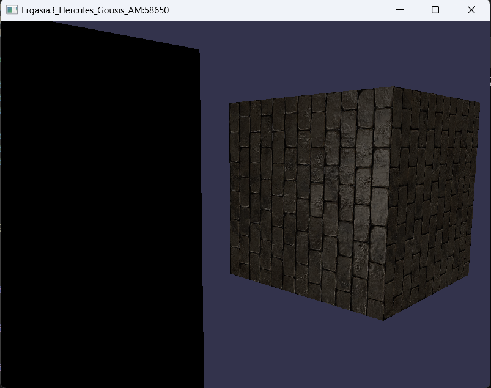
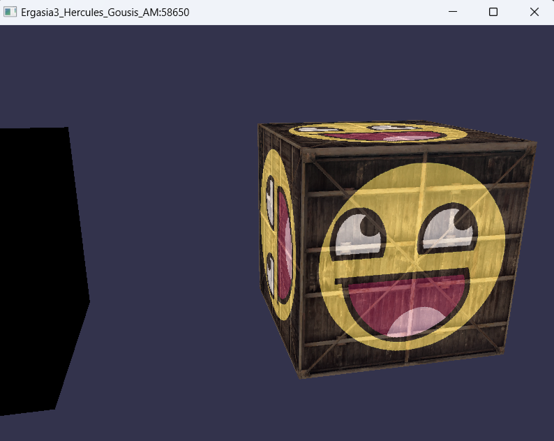
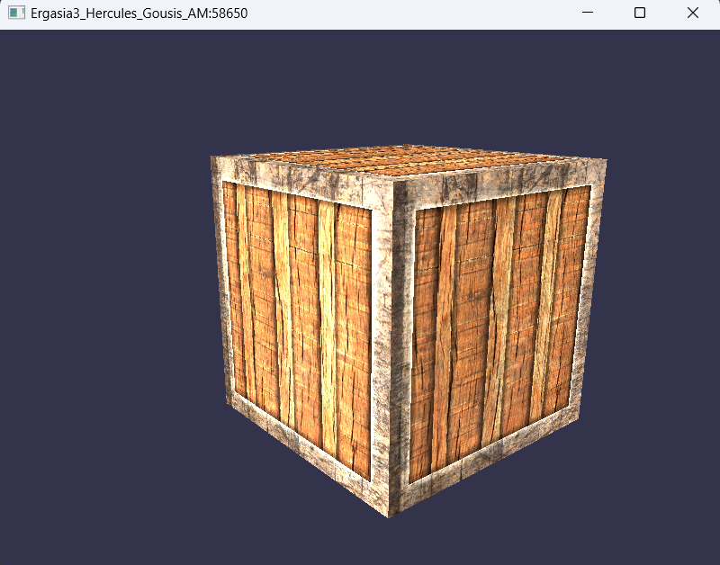
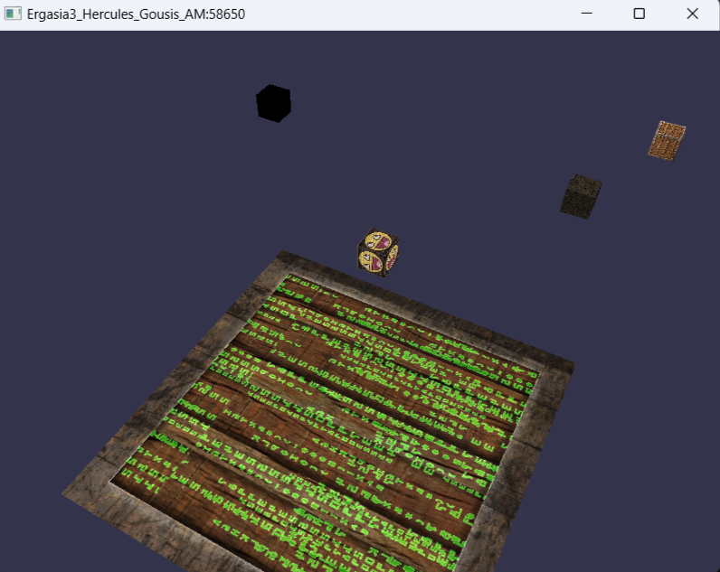

# Εργασία 3 OpenGL
1. Οι εκφωνησείς των ασκήσεων βρίσκονται στο αρχείο [Εργασια 3.pdf](https://github.com/HerGousis/Ergasia_2_OpenGL/blob/master/Ergasia_2_OpenGL/Homework%20files.pdf)
2. Σχετικά με την τυχαία θέση η εκφώνηση έλεγε από -15 έως 15 . Επειδή οι κύβοι έπεφταν στο κενό θεώρησα ότι είναι από -10 έως 10 όπως είναι και η διάσταση του δαπέδου. Για -15 έως 15 έχω βάλει σχόλιο την εντολή που χρειάζεται.

3. Έχω βάλει επιπλέον σε λειτουργιά τα πλήκτρα WSAD για κίνηση για να δείτε τους κύβους από κοντά. Έχω βάλει και σε σχόλιο και μια θέση σταθερή .

4. Κάθε φορά που πατάμε το πλήκτρο UP και DOWN αυξάνεται ή μειώνεται η ταχύτητα . Για να φτάσετε στο όριο πατήστε πολλες φορές τα πλήκτρα  UP ή  DOWN.

5. Παρακάτω υπάρχουν είκονες απο το αποτελέσμα της ασκήσης :

    

    

    

    

    

